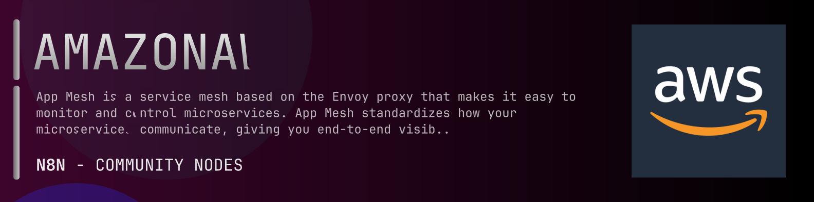

# @n8n-dev/n8n-nodes-amazonaws-appmesh



[](https://www.npmjs.com/package/@n8n-dev/n8n-nodes-amazonaws-appmesh)
[](https://opensource.org/licenses/MIT)

---

**Stop writing amazonaws-appmesh API integrations by hand.**

Every time you connect n8n to amazonaws-appmesh, you waste hours mapping endpoints, defining parameters, and debugging schemas. You copy-paste from docs, fix edge cases, and pray nothing breaks.

**What if connecting n8n to amazonaws-appmesh took 5 minutes, not half a day?**

This node gives you **1+ resources** out of the box: **Default**: with full CRUD operations, typed parameters, and zero manual configuration.

---

## What You Get

- **Zero boilerplate**: Resources, operations, and fields are pre-configured and ready to use
- **Full CRUD**: Create, read, update, and delete support where the API allows it
- **Typed parameters**: No more guessing field types
- **Built-in auth**: API key authentication, ready to go
- **Declarative**: Native n8n performance, no custom execute() overhead

---

## Install

```bash
npm install @n8n-dev/n8n-nodes-amazonaws-appmesh
```

**Or in n8n:**
1. **Settings → Community Nodes → Install**
2. Search: `@n8n-dev/n8n-nodes-amazonaws-appmesh`
3. Click **Install**

---

## Quick Start

1. Install the node (above)
2. Add credentials: **amazonaws-appmesh API** → paste your API key
3. Drag the **amazonaws-appmesh** node into your workflow
4. Pick a resource → pick an operation → done.

That's it. No configuration files. No code. It just works.

---

## Resources

| Resource | Operations |
|----------|------------|
| Default | Put create gateway route, Get list gateway routes, Put create mesh, Get list meshes, Put create route, Get list routes, Put create virtual gateway, Get list virtual gateways, Put create virtual node, Get list virtual nodes, Put create virtual router, Get list virtual routers, Put create virtual service, Get list virtual services, Delete gateway route, Get describe gateway route, Put update gateway route, Delete mesh, Get describe mesh, Put update mesh, Delete route, Get describe route, Put update route, Delete virtual gateway, Get describe virtual gateway, Put update virtual gateway, Delete virtual node, Get describe virtual node, Put update virtual node, Delete virtual router, Get describe virtual router, Put update virtual router, Delete virtual service, Get describe virtual service, Put update virtual service, Get list tags for resource, Put tag resource, Put untag resource |

---

## Why This Node?

**Without this node:**
- Hours of manual API integration
- Copy-pasting from amazonaws-appmesh docs
- Debugging auth, pagination, error handling
- Maintaining your own client code

**With this node:**
- Install → configure → use. 5 minutes.
- Auto-generated from the official amazonaws-appmesh OpenAPI spec
- Always up to date when the API changes
- Native n8n performance

---

## Auto-Generated
This node was auto-generated from the official **amazonaws-appmesh** OpenAPI specification using
[@n8n-dev/n8n-openapi-node-ultimate](https://github.com/kelvinzer0/n8n-openapi-node-ultimate),
then validated against the live API so you get accurate types and real parameters, not guesswork.

When the amazonaws-appmesh API updates, this node updates too.

---

## Support This Project

If this node saved you hours of work, consider supporting continued development, new APIs, better error handling, and faster updates.

[](https://n8n-code.github.io/membership/#/eyJ0aXRsZSI6IktlZXAgSXQgTW92aW5nIiwiZGVzYyI6Ik9uZSBkZXZlbG9wZXIgYnVpbHQgYSB0b29sIHRoYXQgYXV0by1nZW5lcmF0ZXNcbm44biBub2RlcyBmcm9tIGFueSBPcGVuQVBJIHNwZWMuXG5cbllvdXIgZG9uYXRpb24gZnVuZHMgbmV3IGZlYXR1cmVzLCBtb3JlIEFQSSBzdXBwb3J0LFxuYW5kIGJldHRlciB0b29saW5nIGZvciBldmVyeSBkZXZlbG9wZXIgYWZ0ZXIgeW91LiIsInRhcmdldCI6NTAwMCwiYWRkcmVzc2VzIjp7ImV0aGVyZXVtIjoiMHhmMDU1NWQ0MGRiRkI0ZTNCZjA3MDQ0MjgyQjc4RjJmRTFmNTFFZjcyIiwic29sYW5hIjoiNlpEVk5BYmpZZExEcXo4cGt3VUNHYllaNVV3QlFranB0QzU1Wk5vTFcybVUifSwiZGlzY29yZCI6Imh0dHBzOi8vZGlzY29yZC5nZy9wdERaOGU0aDkzIn0)

---

## License

MIT © [kelvinzer0](https://github.com/n8n-code)
